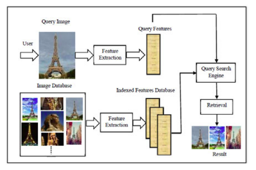

# Algunas ideas del borrador

## Características del problema: **Recuperación de Información basada en Imágenes (Image Information Retrieval)**

La Recuperación de imágenes es el campo que se encarga de buscar y obtener imágenes digitales de una base de datos. Debido a la cantidad creciente de imágenes digitales alrededor del mundo, desde 1970 este campo ha estado bien activo. Un sistema de recuperación efectivo y rápido de imágenes necesita operar sobre una colección de imágenes y devolver las imágenes relevantes basadas en la consulta, la cual se realiza lo más cercana posible a la percepción humana. Los investigadores de este campo poco a poco, han ido mejorando e implementando varios tipos de sistemas de recuperación de imágenes, de los sistemas basados en **palabras claves**, pasando por los sistemas basados en el contenido (características) de una imagen, y finalmente llegando a los sistemas de recuperación semánticos, con el objetivo de reducir el vacío semántico que existe entre la representación de características de bajo nivel (color, textura, forma, etc) y la semántica de alto nivel en las imágenes.

Desarrollar un motor de búsqueda de imágenes omnipotente, capaz de satisfacer a todos los usuarios requiere entender y caracterizar la interacción y la búsqueda de imágenes desde el punto de vista del usuario y del sistema. Desde el punto de vista del usuario, claridad en lo que desea, donde lo quiere buscar y de que forma quiere realizar su consulta. Desde el punto de viste del motor de búsqueda, como desea el usuario que le sean presentados los resultados de su consulta, dónde desea buscar el usuario y cual es la naturaleza de la consulta del usuario.

## Diferencias entre Image Retrieval y Content-based Image Retrieval

La recuperación de imágenes (Image Retrieval) se refiere a la rama de la recuperación de información que se encarga de dada una consulta que puede realizar un usuario de disímiles formas, devolver un ranking de las imágenes que más se asemejen a la consulta hecha por el usuario, teniendo en cuenta alguna medida de similitud. La recuperación de imágenes basada en **contenido** se refiere a un tipo específico de método de recuperación de imágenes que se caracteriza por usar el contenido de las imágenes (color, forma, textura, etc) para realizar el proceso de consulta.

## Principales métodos

Los principales métodos de recuperación de imágenes existentes son:

- Keyword Based Image Retrieval

    Antes de que las imágenes sean almacenadas en la base de datos, son examinadas manualmente y se les asigna una palabra clave (**keyword**) para describir su contenido. Estos **keywords** son almacenados como parte de los atributos asociados a la imagen. En el proceso de hacer una consulta, el sistema aceptará del usuario una o varias **keywords** que serán el criterio de búsqueda. Luego se realiza un proceso para encontrar las imágenes que cumplen con el criterio de búsqueda.

- CBIR (Content-based Image Retrival)

    Está basado principalmente en el contenido visual de las imágenes como el color, la textura y la forma. Las aplicaciones CBIR se convirtieron en parte de una vida práctica y se utiliza en varios comerciales, archivos gubernamentales e instituciones académicas como bibliotecas. CBIR es una alternativa al text-based image retrieval y se convierte en el área de investigación actual del image retrieval. El interés en este método creció debido a las limitaciones de la recuperación de imágenes basadas en palabras clave, ya que esta requiere que los seres humanos describan manualmente cada imagen en la base de datos. Esto es poco práctico para bases de datos grandes o para imágenes que se generan de forma automática, como las de las cámaras de vigilancia.

    

    Los principales componentes de un sistema CBIR son los siguientes:

    Interfaz gráfica de usuario que permite al usuario seleccionar la consulta que puede estar en uno de los siguientes formas:

    Un ejemplo de imagen: recuperación de imágenes basadas en contenido. Los sistemas permiten al usuario especificar una imagen de ejemplo y busca las imágenes que son más similates a esta, presentando en orden decreciente su puntuación de similitud.

    Motor de consulta / búsqueda: es una colección de algoritmos
    responsables de buscar imágenes en la base de datos que es similar a la consulta del usuario

    Base de datos de imágenes: es un repositorio de imágenes.

    Extracción de características: es el proceso de extraer las características visuales (color, forma y textura) de las imágenes.

    Base de datos de características: es un repositorio  de  características de las imágenes.

- Semantic Based Image Retrieval

    Ni una, ni la combinación de varias características visuales o de bajo nivel (color, textura, forma, relación espacial) pueden capturar completamente los conceptos de alto nivel de las imágenes. Además, debido a que el rendimiento de la recuperación de imágenes basado en características de bajo nivel no es satisfactorio, hay una necesidad de que la investigación vaya dirigida hacia la recuperación de imágenes basada en el significado semántico, tratando de utilizar el concepto cognitivo del ser humano para traducir esas características de bajo nivel a conceptos semánticos de alto nivel (vacío semántico). Este acercamiento permite a los usuarios acceder a imágenes a través de consultas por texto, la cual es más intuitiva, fácil y preferida por los usuarios para expresar su deseo. Como mencionamos previamente en el CBIR, las imágenes pasan por un proceso de extracción de características de bajo nivel que se almacena junto con las imágenes, ahora aquí, se hace necesario traducir esas características de bajo nivel a conceptos de alto nivel que no es capaz de comprender una máquina. Esta traducción usualmente se lleva a cabo utilizando herramientas de aprendizaje supervisado o no-supervisado, para asociar las características de bajo nivel con conceptos de alto nivel, los cuáles serán apuntados con palabras, durante el proceso de anotación de imágenes.

    Como podemos ver la recuperación de imágenes basada en la semántica utiliza técnicas de los 2 mecanismos que surgieron previamente, la extracción de características de bajo nivel utilizada en CBIR y la anotación de imágenes utilizada en el mecanismo basado en palabras claves, para almacenar en la imagen palabras (**keywords**) que se obtengan del proceso de conversión de características de bajo nivel a conceptos de alto nivel propio de este nuevo mecanismo.

Todos estos métodos devuelven una colección de imágenes, ordenada por un ranking que se basa en alguna medida de distancia o similitud que indica que tanto se asemeja la imagen a la consulta.

A pesar del esfuerzo hecho durante los primeros años de la investigación en cuanto a recuperación de imágenes, aún no tenemos un algoritmo capaz de caracterizar la visión humana universalmente, más específicamente en el contexto de interpretar las imágenes. Por tanto, no es sorprendente que el esfuerzo actual esté enfocado en esta dirección, ya sea tomando como base trabajos previos o explorando novedosos métodos.

En comparación con el trabajo hecho en el siglo pasado en lo que respecta a CBIR, una gran diferencia en los años recientes ha sido la creciente diversidad de las marcas en las imágenes. Se han hecho avances en la derivación de nuevas características como la forma, y la construcción de nuevas marcas sobre estas características. La riqueza en la formulación matemática de las marcas crece a la par de la invención de nuevos métodos para medir la similitud.

En términos de desarrollo de métodos, una vertiente fuerte que ha emergido en los recientes años ha sido el uso de técnicas estadísticas y de aprendizaje de máquinas en varios aspectos de la tecnología CBIR. Aprendizaje automático, principalmente clustering y clasificación, son usados para crear marcas adaptativas o estáticas, para mejorar las medidas de similitud, e incluso servir como el núcleo de ciertos esquemas de búsquedas, como la retroalimentación de relevancia.

## Evaluación del sistema

La recuperación de imágenes es esencialmente un problema de recuperación de información. Por tanto, las métricas de evaluación
han sido adoptados de forma bastante natural a partir de la investigación de recuperación de información. Dos de las
Las medidas de evaluación más populares son:

- Precisión: el porcentaje de imágenes recuperadas que son relevantes para la consulta.
- Recobrado: el porcentaje de todas las imágenes relevantes en la base de datos de búsqueda que se recuperan.

Es importante tener en cuenta que cuando la consulta en cuestión es una imagen, la relevancia es extremadament subjetiva. La investigación sobre recuperación de información ha demostrado que la precisión y la recobrado siguen una relación inversa. La precisión cae mientras que la recobrado aumenta a medida que el número de imágenes recuperadas, a menudo denominadas alcance, aumenta. Por lo tanto, es típico que tengan un valor numérico alto tanto para la precisión como para la recuperación. Tradicionalmente, los resultados se resumen como curvas de recuperación de precisión o curvas de alcance de precisión. Una critica por la precisión se deriva del hecho de que se calcula para todo el conjunto recuperado y esta no se ve afectada por las clasificaciones respectivas de las entidades relevantes en la lista recuperada. Una medida que aborda el problema anterior y es muy popular en la comunidad de recuperación de imágenes, es la precisión media (AP). En una lista clasificada de entidades recuperadas con respecto a una consulta, si la precisión se calcula en la profundidad de cada entidad relevante obtenida, la precisión promedio se da como la media de toda la precisión individual. Como es obvio, esta métrica está muy influenciada por elementos relevantes de alto rango y no tanto por los que se encuentran al final de la lista recuperada.

## Aplicaciones

El campo de la recuperación de imágenes ha demostrado ser uno necesario para los tiempos en que vivimos, donde tantas imágenes se generan diariamente, desde satélites orbitando la Tierra, misiones espaciales en lo más lejos del cosmos, animales en la naturaleza, paisajes, cámaras de seguridad y mucho más. Las imágenes son una fuente de información muy útil en la actualidad, y por tanto almacenarlas y organizarlas es una tarea necesaria, para facilitar el acceso a la información. De ahí que este campo tenga una gran cantidad de aplicaciones en la actualidad, a continuación mencionamos algunas de las más importantes:

- El problema de la anotación automática de imágenenes. El propósito principal de un sistema de recuperación de imágenes basado en contenido
es descubrir imágenes que pertenecen a algún concepto, en la ausencia de meta-datos, todos los intentos de automatizar el proceso de creación de estos meta-datos tiene ese objetivo. La anotación de imágenes puede facilitar la búsqueda de imágenes utilizando texto. Si el mapeo resultante imagen-palabras clave es confiable, la búsqueda de imagen basada en texto puede tener semánticamente más sentido que buscar en la ausencia de texto. Uno de los métodos para resolver este problema de la anotación automática es usar aprendizaje supervisado para categorizar las imágenes. La detección de conceptos simples como: paisaje, ciudad, animales, etc, alcanza una alta precisión.

- El arte y la cultura siempre han sido importantes en la vida del ser humano. A lo largo de la historia, los museos y galerías de arte del mundo se han encargado de preservar nuestra diversa herencia cultural para utilizarlos como fuentes educación y aprendizaje. Es por esto que recientemente se ha expresado la preocupación por digitalizar todos los materiales antiguos, históricos y culturales, para la posteridad.
Esto es muy importante por dos razones, primero las computadoras se han convertido en el principal medio de aprendizaje y se supone que así sea durante los próximos años, por tanto la representación digital de los artefactos culturales y las imágenes es algo que facilitará su popularidad, además de que sería accesible desde cualquier rincón del mundo, y segundo al contrario de la información almacenada de forma digital, los artefactos y pinturas antiguas están a merced a la degradación con el paso del tiempo, a los desastres y al vandalismo.

- Las interacciones entre CBIR y la seguridad de la información ha sido prácticamente nulo, hasta que recientemente ciertas perspectivas han emergido para unir ambos campos, las pruebas de interacción humana
(HIPs por sus siglas en inglés) y el cumplimiento de la protección de los derechos de autor. Mientras por un lado constantemente estamos ampliando las fronteras de la ciencia para diseñar sistemas que pueda imitar las capacidades humanas, no podemos negar los riesgos de seguridad inherentes asociados con programas extremadamente "inteligentes". Uno de dichos riesgos es cuando un sitio web o algún servidor es atacado por programas maliciosos que solicitan servicios a escalas masivas. Pueden ser escritos programas que consuman una gran cantidad de recursos web o que influyan en los resultados de votaciones. En este caso los HIPs también conocidos como CAPTCHAs, son la solución. Estas interfaces están diseñadas para diferenciar entre humanos o programas, basados en la respuesta a algunas preguntas.

## Ventajas y desventajas

